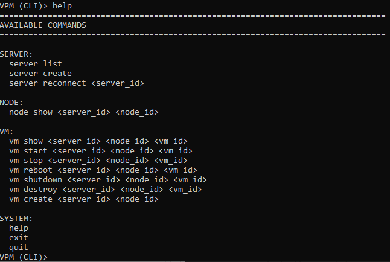
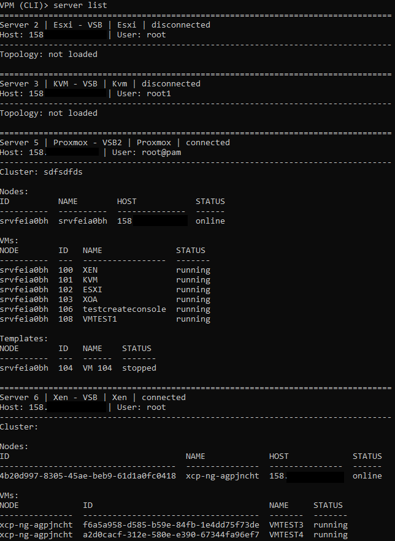
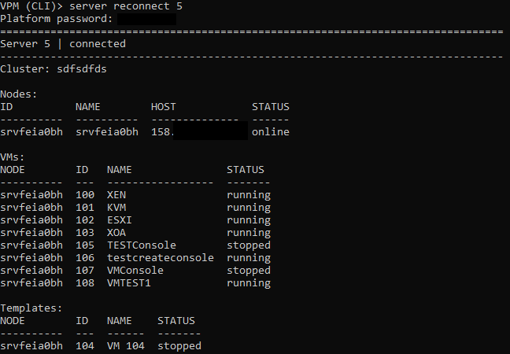
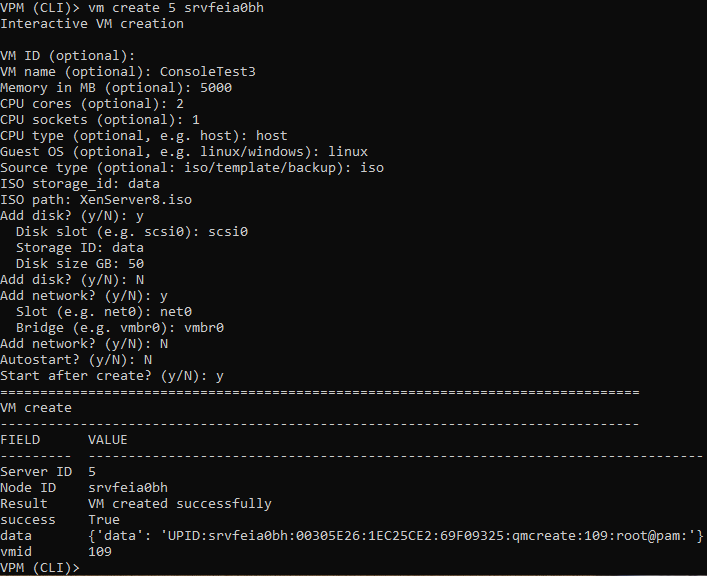
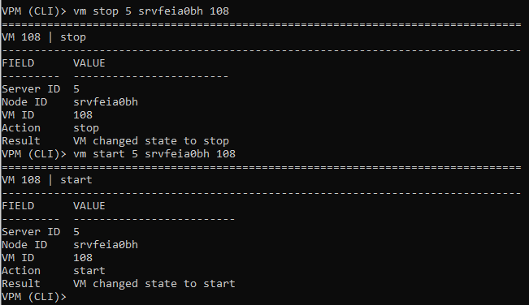

# Konzole

Aplikace obsahuje jednoduché konzolové rozhraní dostupné přes SSH, které umožňuje základní správu serverů, uzlů a virtuálních strojů pomocí příkazů.

Konzole slouží především pro rychlé provádění operací bez použití grafického rozhraní.

---

## Nápověda

Pro zobrazení dostupných příkazů lze použít nápovědu pomocí příkazu **help**.

---

## Seznam serverů

Příkaz pro výpis serverů zobrazí:

- seznam přidaných serverů
- jejich stav (**connected / disconnected**)
- topologii (uzly, virtuální stroje, šablony)

---

## Opětovné připojení k serveru

Server lze pomocí konzole znovu připojit zadáním přihlašovacích údajů.

Po úspěšném připojení se načte aktuální topologie serveru.

---

## Správa virtuálních strojů

### Vytvoření VM

Pomocí konzole lze vytvořit nový virtuální stroj zadáním parametrů.

---

### Změna stavu VM

Konzole umožňuje provádět základní operace nad virtuálním strojem:

- **start**
- **stop**
- **shutdown**
- **reboot**
- **reset**

---