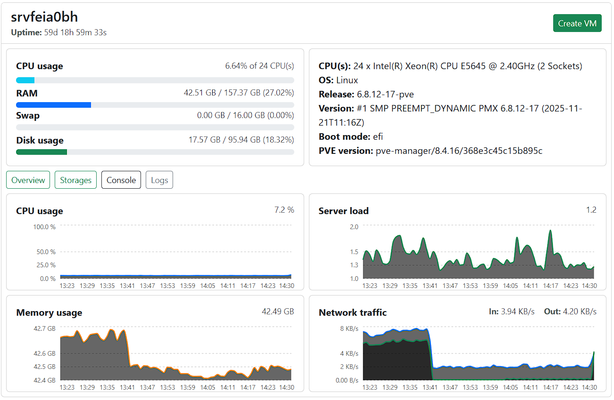
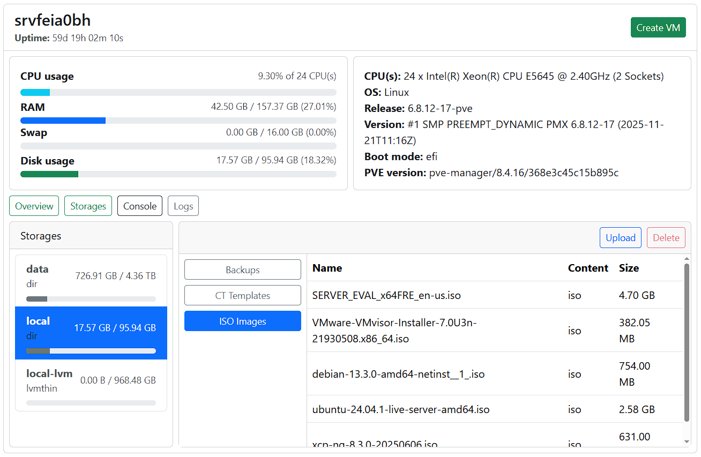
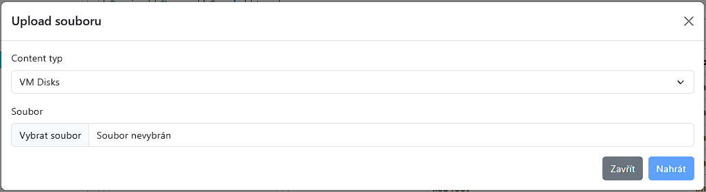
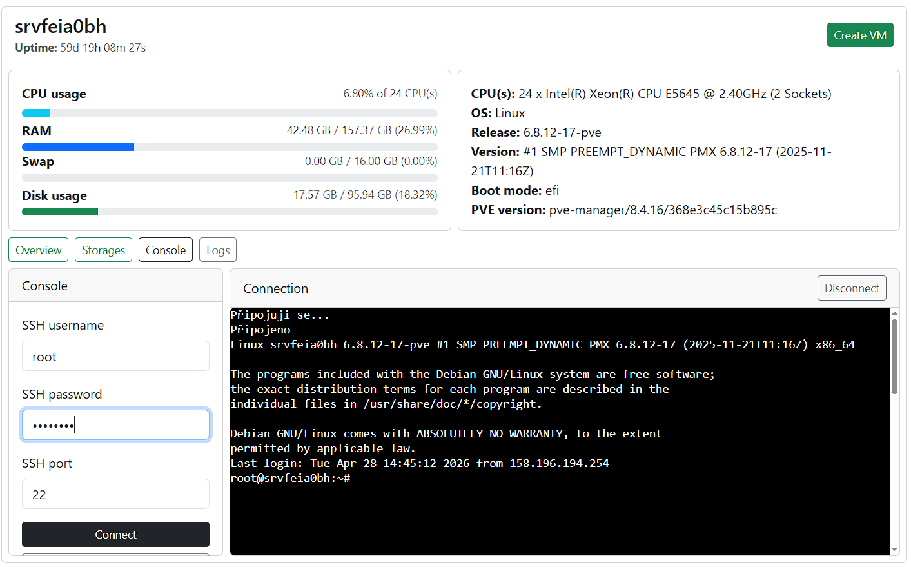
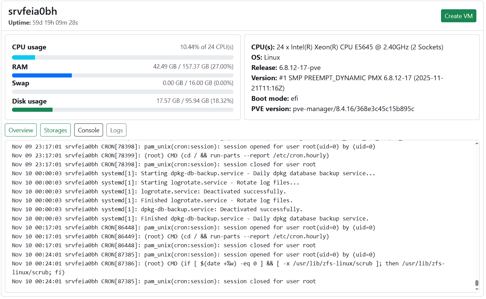
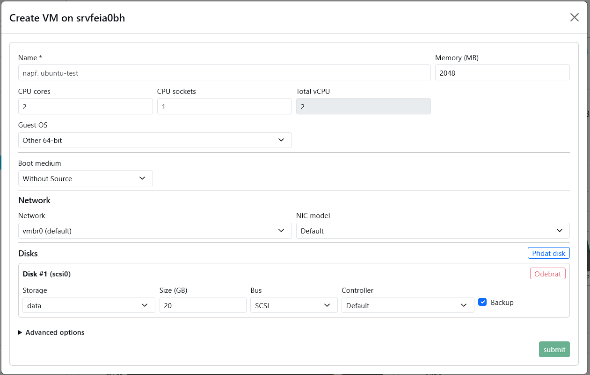

# Uzly

Sekce **Uzly** slouží ke správě jednotlivých uzlů v rámci připojeného serveru.

Uzel představuje fyzický nebo virtuální host, na kterém běží virtuální stroje. V rámci uzlu je možné pracovat s úložišti, logy a konzolí.

---

## Node – detail

Po kliknutí na uzel ve stromové struktuře se zobrazí jeho detail.

Detail uzlu je rozdělen do několika částí:

- **Overview** – grafy zobrazující metriky uzlu, které se pravidelně aktualizují
- **Storages** – přehled úložišť dostupných na uzlu
- **Console** – konzolové připojení k uzlu
- **Logs** – logy související s uzlem

---

## Storage

Sekce **Storage** slouží ke správě úložišť dostupných na vybraném uzlu.

V této části lze zobrazit jednotlivá úložiště a soubory, které jsou na uzlu k dispozici.

Součástí tohoto zobrazení je také možnost:

- nahrávání souborů (ISO nebo diskových obrazů)
- mazání souborů uložených v rámci jednotlivých úložišť

---

### Nahrání souboru do storage

Soubor lze do úložiště nahrát pomocí tlačítka **Upload**, které je dostupné pouze pro ISO a disková úložiště.

Postup nahrání souboru:

<ol>
  <li>Vyberte uzel ve stromové struktuře</li>
  <li>Otevřete sekci <strong>Storage</strong></li>
  <li>Vyberte konkrétní úložiště</li>
  <li>Klikněte na tlačítko <strong>Upload</strong></li>
  <li>Vyberte soubor ze zařízení</li>
  <li>Potvrďte nahrání</li>
</ol>

Po dokončení bude soubor dostupný ve vybraném úložišti.

## Konzole uzlu

Sekce **Console** umožňuje konzolový přístup k vybranému uzlu.

Konzole slouží k zobrazení výstupu nebo interakci s uzlem pomocí dostupného konzolového protokolu dané platformy.

Podporovaný způsob připojení se může lišit podle typu platformy. U některých platforem může být dostupné například SSH připojení, u jiných může být konzole řešena odlišným způsobem.

---

## Logy uzlu

Sekce **Logs** zobrazuje logy související s vybraným uzlem.

Logy lze využít například pro:

- kontrolu provedených akcí
- dohledání chyb
- ověření stavu operací
- diagnostiku problémů

---

## Vytvoření virtuálního stroje

Z detailu uzlu lze vytvořit nový virtuální stroj.

Při vytváření virtuálního stroje lze zvolit způsob vytvoření podle možností konkrétní platformy.

Dostupné zdroje pro vytvoření virtuálního stroje mohou být:

- **Without source** – vytvoření prázdného virtuálního stroje bez instalačního média
- **ISO** – vytvoření virtuálního stroje s připojeným ISO obrazem
- **Backup** – vytvoření virtuálního stroje ze zálohy
- **Template** – vytvoření virtuálního stroje ze šablony

Dostupné možnosti se mohou u jednotlivých platforem lišit:

- **Proxmox** - vytvoření ze šablony, ISO obrazu, zálohy nebo bez zdroje
- **ESXi** - vytvoření bez zdroje, z ISO obrazu nebo ze zálohy
- **KVM** - vytvoření bez zdroje, z ISO obrazu nebo ze zálohy
- **Xen** - vytvoření ze statické šablony, ISO obrazu nebo ze zálohy

Pro vytvoření virtuálního stroje:

<ol>
  <li>Vyberte uzel, na kterém má být virtuální stroj vytvořen</li>
  <li>Klikněte na možnost vytvoření virtuálního stroje</li>
  <li>Vyberte způsob vytvoření virtuálního stroje</li>
  <li>Vyplňte požadované parametry</li>
  <li>Potvrďte vytvoření</li>
</ol>

Po úspěšném vytvoření se virtuální stroj zobrazí ve stromové struktuře pod příslušným uzlem.

---