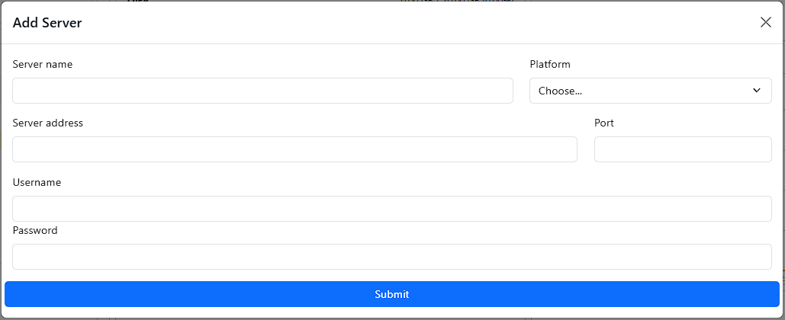
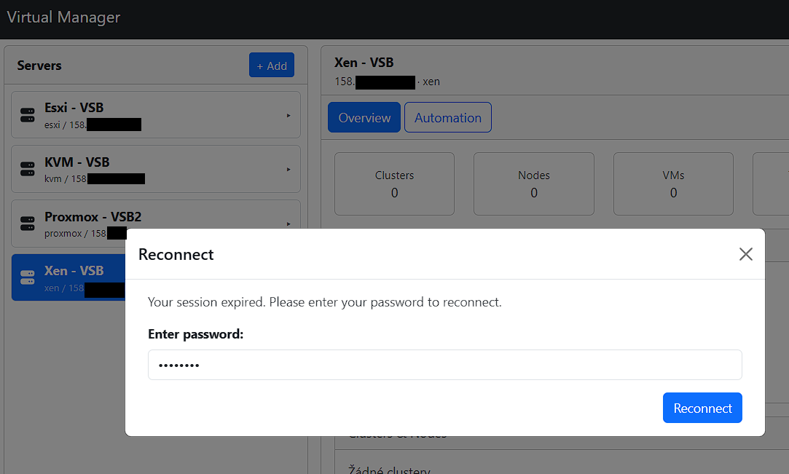
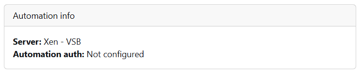
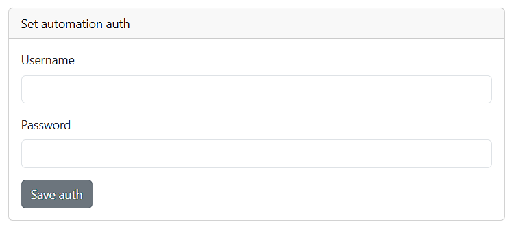
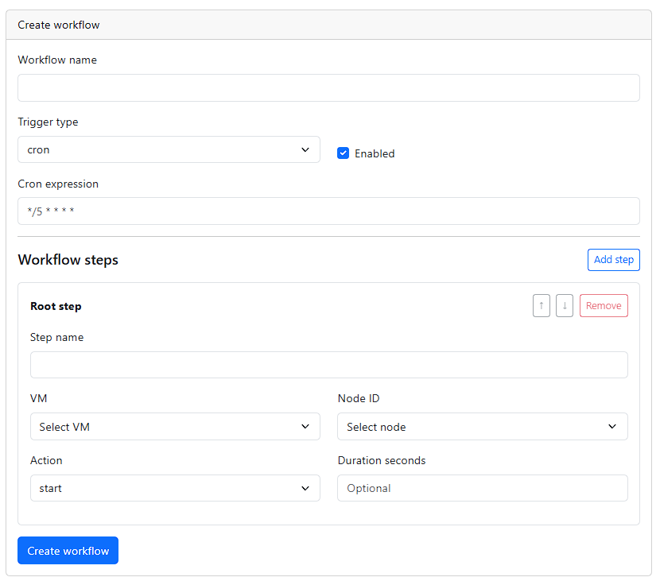
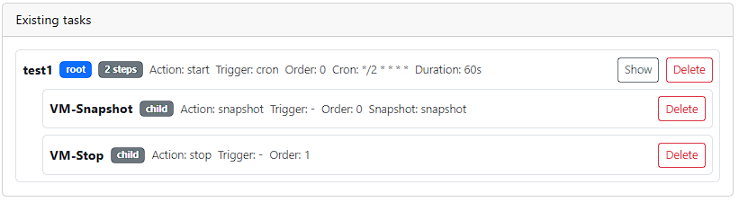

# Servery

Sekce **Servery** slouží ke správě připojení k virtualizačním platformám (Proxmox, ESXi, KVM, Xen).

---

## Přehled serverů (Domovská stránka)
Po úspěšném přihlášení je uživatel přesměrován na hlavní stránku aplikace.

Na levé straně obrazovky se nachází stromová struktura serverů. Pokud má uživatel uložené servery z předchozí práce, jsou automaticky načteny a zobrazeny.

Tlačítko **+ Add** je v této části také a umožňuje přidání nového serveru.

Tyto servery:

- jsou evidovány v databázi
- nemusí být aktuálně připojené (uživatel zatím není připojen k serveru)
- lze je znovu připojit (reconnect)

---

## Přidání serveru

Server lze přidat pomocí tlačítka **+ Add**, které se nachází ve stromové struktuře serverů.

Pro přidání serveru:

<ol>
  <li>Klikněte na tlačítko <strong>+ Add</strong></li>
  <li>
    Vyplňte následující údaje:
    <ul>
      <li>název serveru</li>
      <li>platformu</li>
      <li>host (IP / doména)</li>
      <li>port (volitelné)</li>
      <li>přihlašovací údaje</li>
    </ul>
  </li>
  <li>Potvrďte formulář</li>
</ol>

Po úspěšném připojení se načte topologie serveru (uzly, virtuální stroje a šablony) a bude dostupná v rámci stromové struktury.

---

## Opětovné připojení serveru

Server, který není aktuálně připojen, lze znovu aktivovat pomocí funkce **Reconnect**.

Pro opětovné připojení serveru:

<ol>
  <li>Vyberte server ze seznamu a klikněte na něj</li>
  <li>Objeví se formulář pro opětovné připojení</li>
  <li>Zadejte přihlašovací heslo</li>
  <li>Potvrďte akci</li>
</ol>

Po úspěšném připojení se znovu načte topologie serveru a bude dostupná v rámci stromové struktury.

---

## Stav serveru

Každý server může být v jednom z následujících stavů:

- **connected** – server je dostupný v rámci aplikace
- **disconnected** – server není dostupný v rámci aplikace

Stav serveru ovlivňuje dostupnost jeho funkcí:

- načítání uzlů (nodes)
- práce s virtuálními stroji
- provádění operací nad infrastrukturou

Server ve stavu **disconnected** je stále evidován v aplikaci, ale před použitím je potřeba se k němu znovu připojit, aby bylo možné se serverem pracovat.

---

## Server – detail

Zobrazuje detail vybraného serveru a jeho infrastruktury.

V rámci rozhraní lze rozbalit stromovou strukturu a zobrazit jednotlivé části infrastruktury.

Součástí zobrazení je také tlačítko **Automation**, které umožňuje přejít do části aplikace pro správu automatických úloh a nastavení přístupových údajů pro jejich vykonávání na vzdáleném serveru.

Po kliknutí na server se zobrazí:

- seznam uzlů (nodes)
- počet virtuálních strojů na jednotlivých uzlech
- počet šablon (templates) na jednotlivých uzlech

## Automatizace

Sekce **Automation** umožňuje nastavovat a spravovat automatické úlohy nad vybraným serverem, například plánované operace nad virtuálními stroji.

---

### Konfigurace přístupů

Po otevření sekce Automation se zobrazí aktuální stav konfigurace:

- pokud jsou přístupové údaje nastaveny, zobrazí se informace o účtu
- pokud nejsou nastaveny, zobrazí se informace, že automatizace není nakonfigurována

Pro využití automatizace je nejprve nutné nastavit přístupové údaje.

---

### Nastavení přístupových údajů

Přístupové údaje lze uložit pomocí formuláře uvnitř Automation části:

<ol>
  <li>Otevřete sekci <strong>Automation</strong></li>
  <li>Zadejte požadované přihlašovací údaje</li>
  <li>Uložte konfiguraci</li>
</ol>

Tyto údaje jsou následně používány pro vykonávání automatických úloh na vzdáleném serveru.

---

### Vytvoření úlohy

Pro vytvoření nové automatizační úlohy:

<ol>
  <li>Vyberte typ akce</li>
  <li>Nastavte čas nebo interval spuštění</li>
  <li>Uložte úlohu</li>
</ol>

---

### Seznam úloh
V této části se zobrazuje seznam všech vytvořených úloh.

U každé úlohy lze vidět:

- typ akce
- čas nebo interval spuštění
- aktuální stav

Součástí je také tlačítko pro zobrazení či schování podtasků a následně tlačítko pro mazání.

---