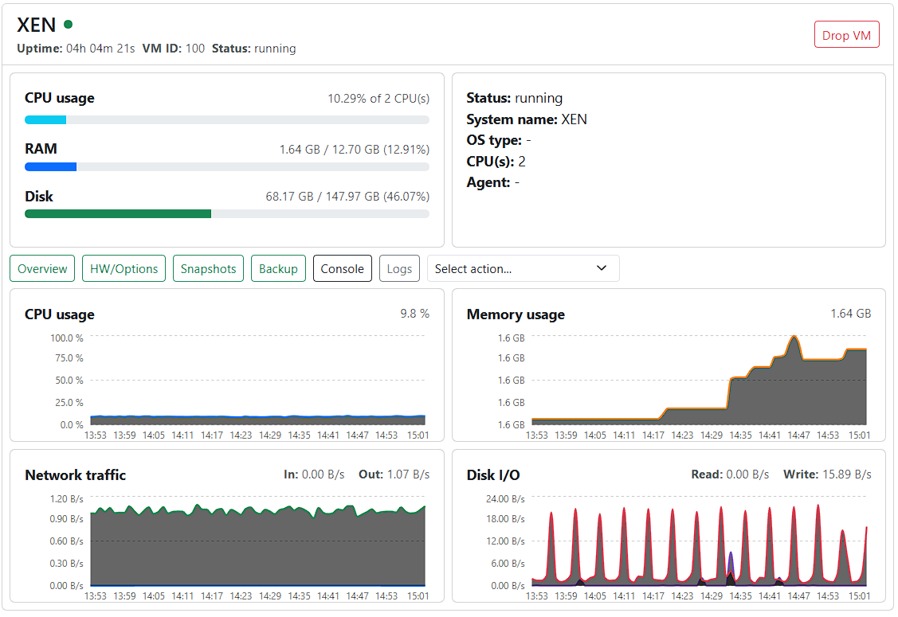
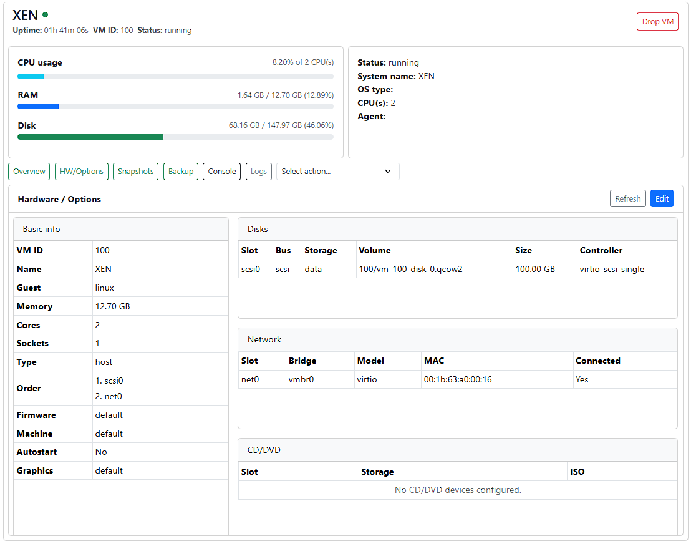
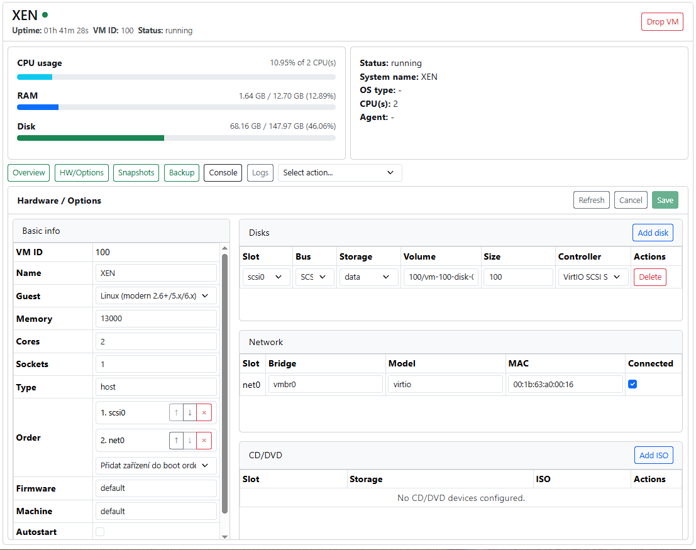
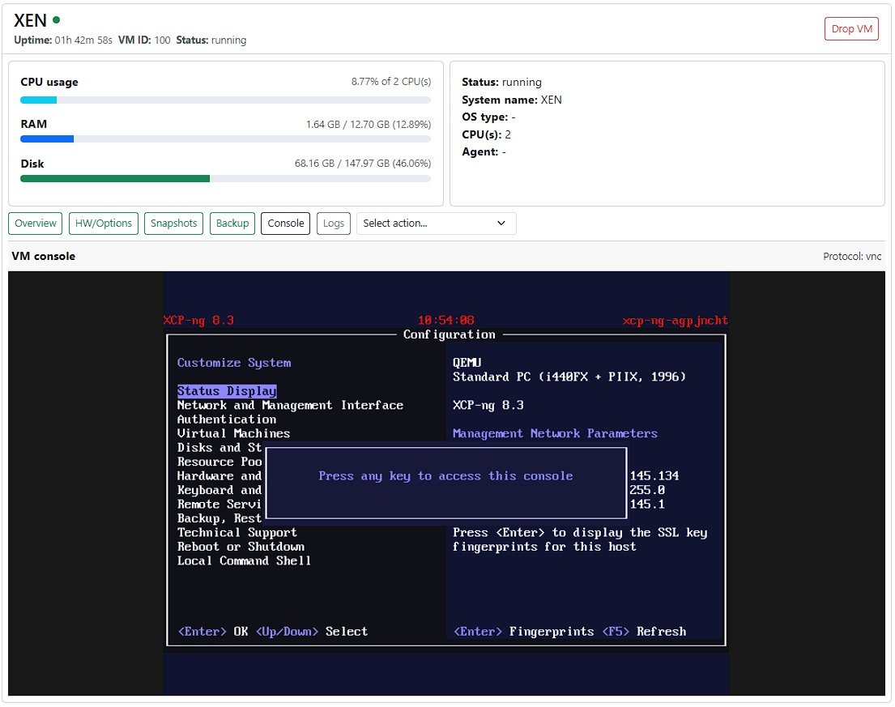
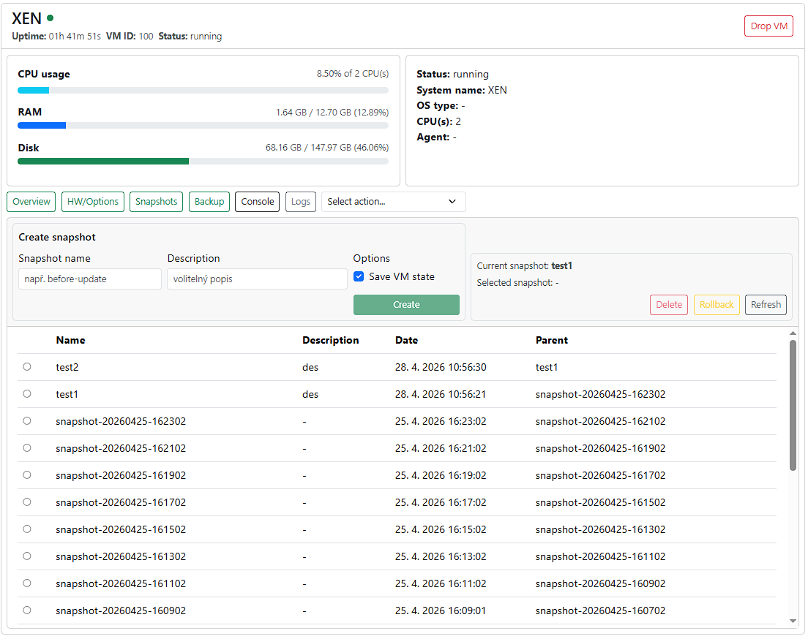
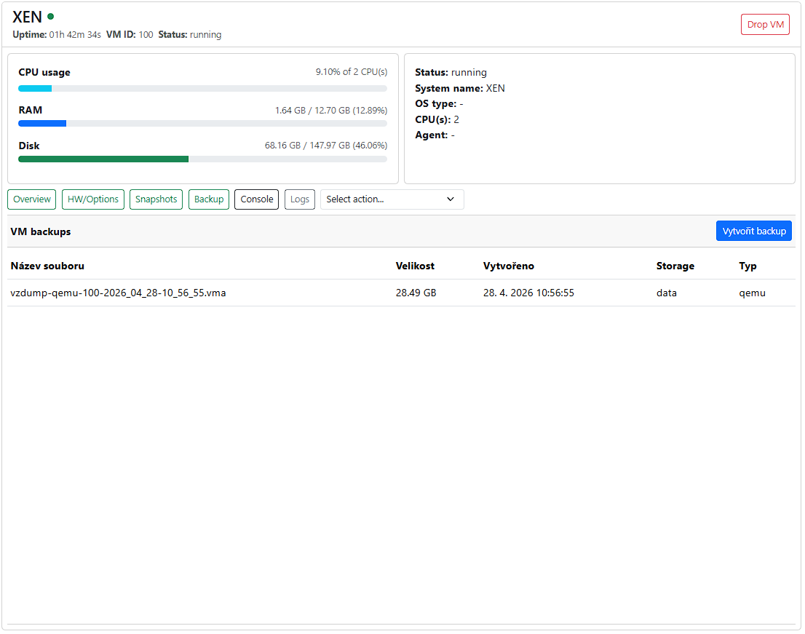
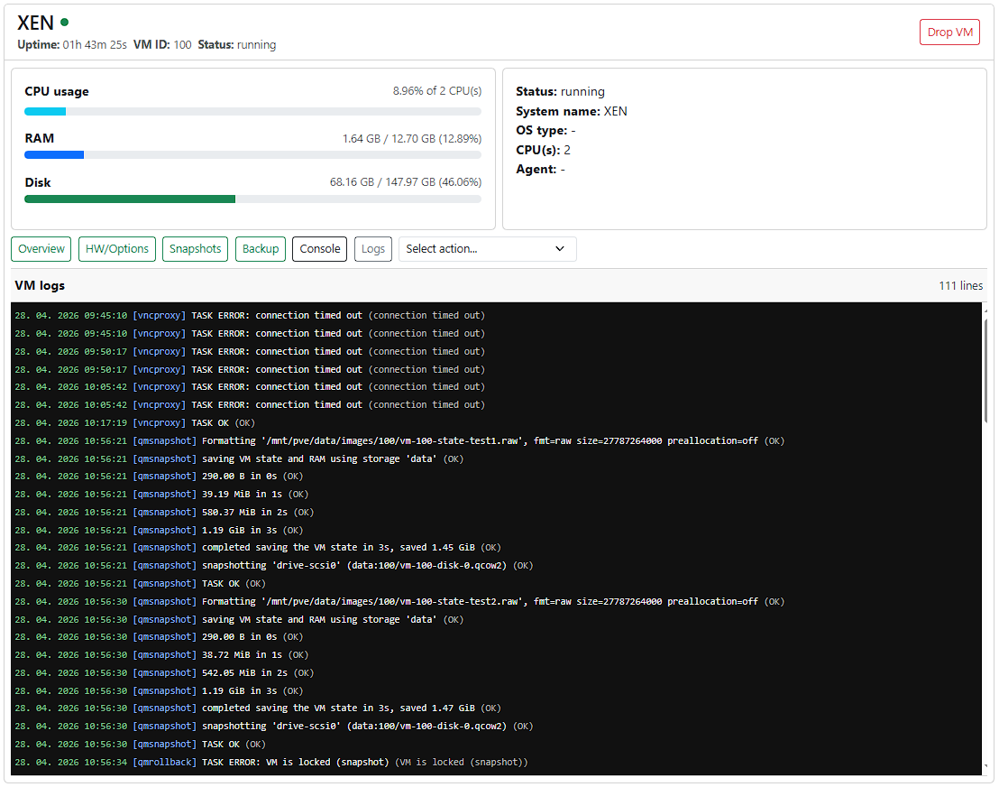
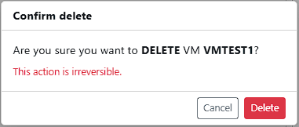

# Virtuální stroje

Sekce **Virtuální stroje** slouží ke správě jednotlivých virtuálních strojů v rámci uzlů.

Virtuální stroj (VM) představuje izolované prostředí běžící na vybraném uzlu.

Každý VM má vlastní konfiguraci CPU, paměti, disků, sítí a dalších parametrů.

---

## VM – detail

Po kliknutí na virtuální stroj ve stromové struktuře se zobrazí jeho detail.

Detail virtuálního stroje je rozdělen do několika částí:

- **Overview** – základní informace a grafy využití (CPU, paměť, disk)
- **HW/Options** – konfigurace virtuálního stroje (CPU, RAM, disky apod.)
- **Snapshots** – správa snapshotů virtuálního stroje
- **Backup** – přehled a správa záloh
- **Console** – konzolové připojení k virtuálnímu stroji
- **Logs** – logy související s virtuálním strojem

---

## Stav virtuálního stroje

Virtuální stroj může být v různých stavech:

- **Running** – spuštěný
- **Stopped** – vypnutý
- **Suspended** – pozastavený

Změnu stavu VM lze provést pomocí nabídky akcí (**Select action**), která se nachází v detailu virtuálního stroje.

Dostupné akce:

- **Start** – spuštění virtuálního stroje
- **Stop** – okamžité vypnutí (tvrdé vypnutí)
- **Shutdown** – korektní vypnutí operačního systému
- **Reboot** – restart virtuálního stroje (soft restart)
- **Reset** – okamžitý restart bez korektního vypnutí (tvrdý restart)
- **Suspend / Resume** – pozastavení a následné obnovení běhu

---

## Konfigurace virtuálního stroje

Sekce **HW/Options** umožňuje zobrazit a upravit konfiguraci virtuálního stroje.

### Zobrazení konfigurace

V základním režimu jsou hodnoty pouze pro čtení a slouží k přehledu aktuální konfigurace.

---

### Úprava konfigurace

Po přepnutí do režimu úprav lze jednotlivé parametry měnit.

Konfigurovat lze například:

- CPU (počet jader, socketů)
- paměť
- disky
- síťová rozhraní (dostupná na daném uzlu)
- boot parametry
- grafickou kartu / konzoli (aktualně podporované pouze default - vnc, webmks)
- další volby (např. start_after_create – automatické spuštění po vytvoření)

Některé změny mohou vyžadovat vypnutí virtuálního stroje.

---

## Konzole virtuálního stroje

Sekce **Console** umožňuje přímý přístup do virtuálního stroje.

Konzole slouží pro:

- instalaci operačního systému
- přímou interakci s virtuálním strojem

Pro připojení ke konzoli jsou využívány následující technologie:

- **VNC** – pro většinu podporovaných platforem
- **WebMKS** – pro platformu ESXi

---

## Snapshoty

Sekce **Snapshots** umožňuje práci se snapshoty virtuálního stroje.

Možnosti:

- zobrazení seznamu existujících snapshotů
- vytvoření nového snapshotu pomocí tlačítka **Create**
- návrat (**Rollback**) na vybraný snapshot
- odstranění snapshotu

Při vytváření snapshotu lze nastavit:

- název snapshotu
- volitelný popis (description)
- uložení stavu virtuálního stroje (VM state)

Snapshot představuje uložený stav virtuálního stroje v konkrétním čase, ke kterému se lze kdykoliv vrátit.

---

## Zálohy

Sekce **Backups** slouží ke správě záloh virtuálního stroje.

Možnosti:

- zobrazení dostupných záloh daného virtuálního stroje
- vytvoření nové zálohy

Zálohy jsou vytvářeny jako plné zálohy virtuálního stroje.

---

## Logy virtuálního stroje

Sekce **Logs** zobrazuje logy související s operacemi nad virtuálním strojem.

Logy obsahují například:

- vytvoření a odstranění virtuálního stroje
- změny konfigurace
- operace se snapshoty
- zálohování
- operace start/stop

Logy slouží především pro sledování historie operací a diagnostiku problémů.

---

## Smazání virtuálního stroje

Virtuální stroj lze odstranit z uzlu pomocí akce **Drop**.

- odstranit virtuální stroj včetně disků

Tato operace je nevratná a může vést ke ztrátě dat.

---